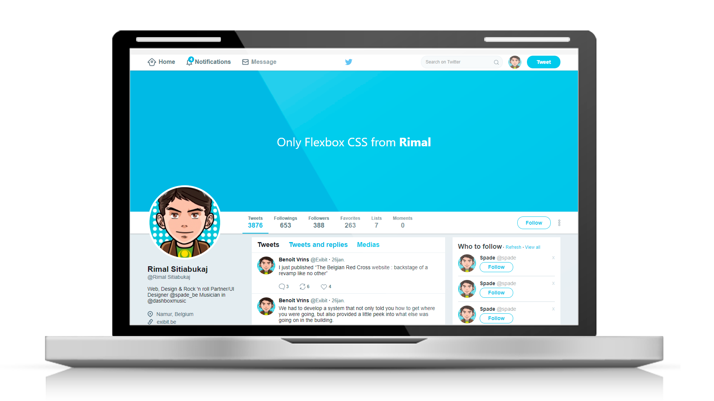

# FLEX BOX

<h1 align="center">
  💻 Twitter layout com Flexbox Css
</h1>

  

## 💻 Sobre o Projeto

Desenhar um layout do Twitter usando somente Flexbox containers.

 ## 💻 Tecnologias do Projeto
<h4 align="center">
   - CSS, Flexbox
</h4>

- [Flexbox Mozilla](https://developer.mozilla.org/pt-BR/docs/Web/CSS/CSS_Flexible_Box_Layout)

## 💻 Como acessar esse repositório
- Faça um fork do repositório
- Faça um push para a sua branch: `git push origin minha-feature`

## :memo: Licença

Esse projeto está sob a licença MIT. Para mais detalhes acesse: [LICENSE](.github/LICENSE.md).

